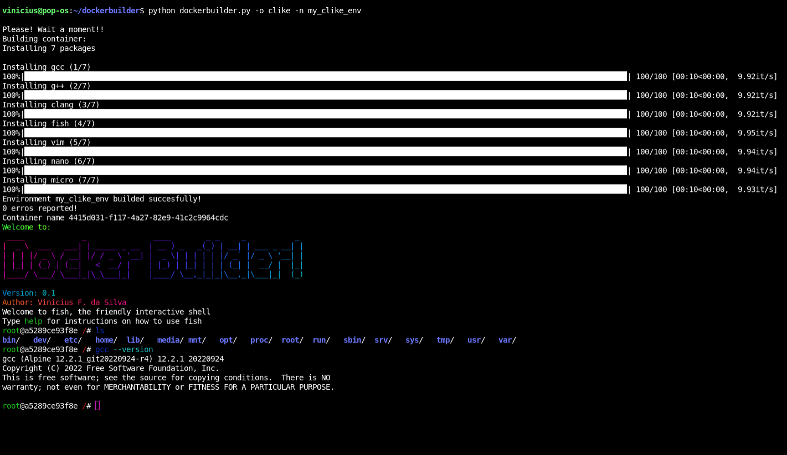

* Author: Vinicius F. da Silva
* Version 0.1
* Released: 2023

A very simple system that build Docker containers from a small Alpine Docker image!

The Docker Builder offer a multiples templates from Clike, Java and Python. From users' argument the Docker Builder create a small environment with templates avaliable on the system.

Avaliable system arguments:

* "clike" : Build a C/C++ environment, installing from template with cpp, g++ and clang compilers

* "java" : Build a Java environment, installing from template with multiples versions of JDK (8, 11, 17)

* "python" : Build a Python environment, installing from template with python3 and pip3 packages

# Example:

#### Building a clike environment

